# 🍽️ Restaurant Order Management System

A real-time order management system for restaurants.  
Customers (or waiters) place orders from a tablet, which are instantly delivered to the kitchen via WebSockets.

---

## 🎬 Demo

<p align="center">
  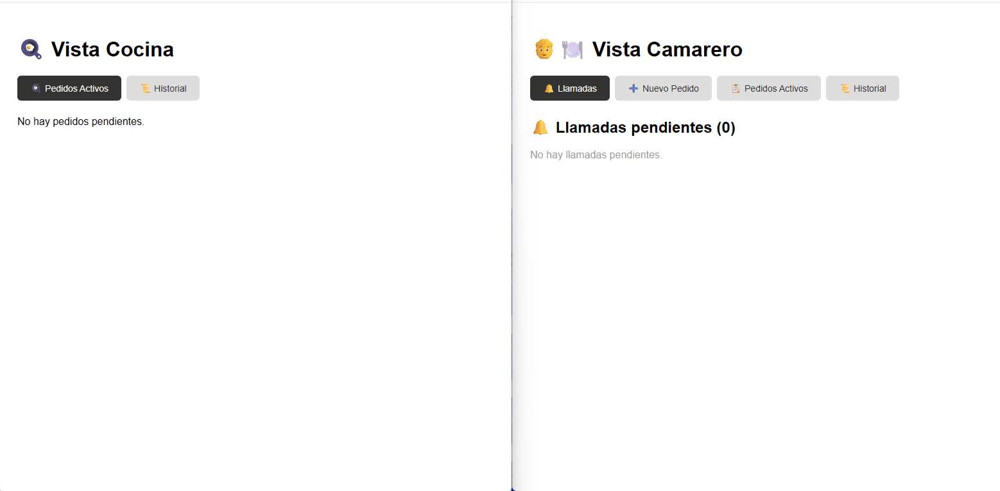
</p>

---

## 🛠️ Tech Stack

### Backend
- **Java 17**
- **Spring Boot**
- **Spring Data JPA / Hibernate**
- **WebSockets (STOMP)**
- **MySQL**
- **Lombok**
- **Maven**

### Frontend
- **React**

---

## 🏗️ Architecture

The project follows a clean layered architecture:

```
Controller → Service → Repository → Entity
```

- **Controller** — exposes REST endpoints
- **Service** — contains business logic
- **Repository** — database access via Spring Data JPA
- **DTO** — transfer objects to avoid exposing entities directly
- **Entity** — database models

## ✨ Features

### 🔐 Admin Panel
- Login required
- Create and manage:
  - Tables
  - Categories
  - Products
- Edit and delete existing data

---

### 🧾 Order Management (Waiter)
- Place orders from a table
- Add multiple items to an order
- Add custom notes
- Send orders to the kitchen in real time

---

### 👨‍🍳 Kitchen View
- Receive orders instantly via WebSockets
- Update order status:
  - `PENDIENTE`
  - `EN_PREPARACION`
  - `LISTO`
  - `ENTREGADO`

---

### 🔄 Real-Time System
- New orders appear instantly in the kitchen
- Status updates reflect immediately for the waiter
- No page refresh required

---

### 📊 Order Tracking
- Waiters can track order status in real time
- Kitchen and waiter share:
  - Active orders
  - Completed order history

---

## 🔄 Real Workflow

1. Admin creates:
   - Tables
   - Categories
   - Products

2. Waiter:
   - Creates an order
   - Adds items and notes
   - Sends it to the kitchen

3. Kitchen:
   - Receives order instantly
   - Updates status → `EN_PREPARACION` → `LISTO`

4. Waiter:
   - Sees updates in real time
   - Picks up the order
   - Marks it as `ENTREGADO`

5. System:
   - Updates all views automatically
   - Stores completed orders in history

---

## 📸 Screenshots

### Admin Panel
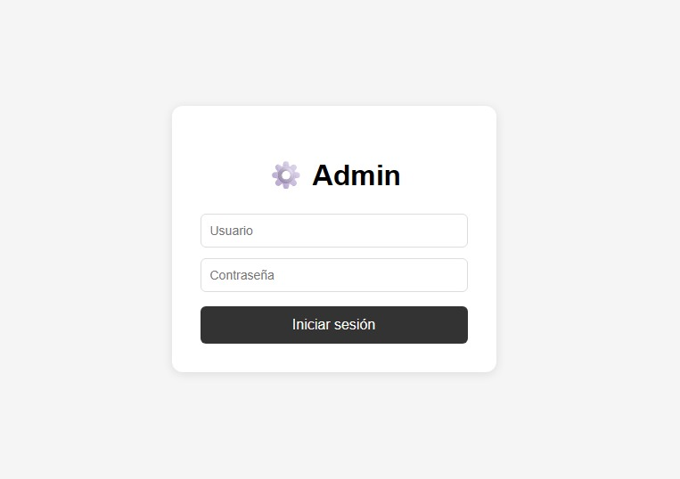
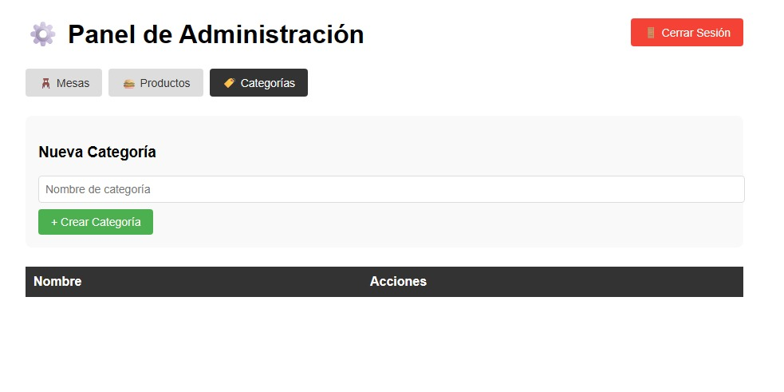
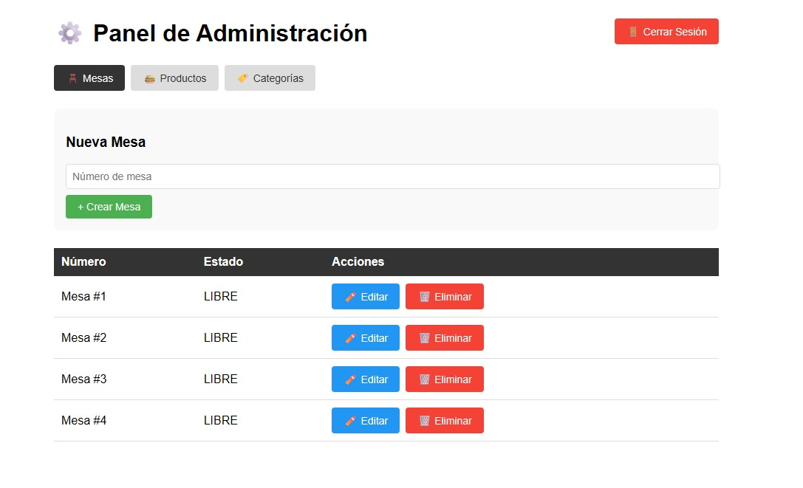
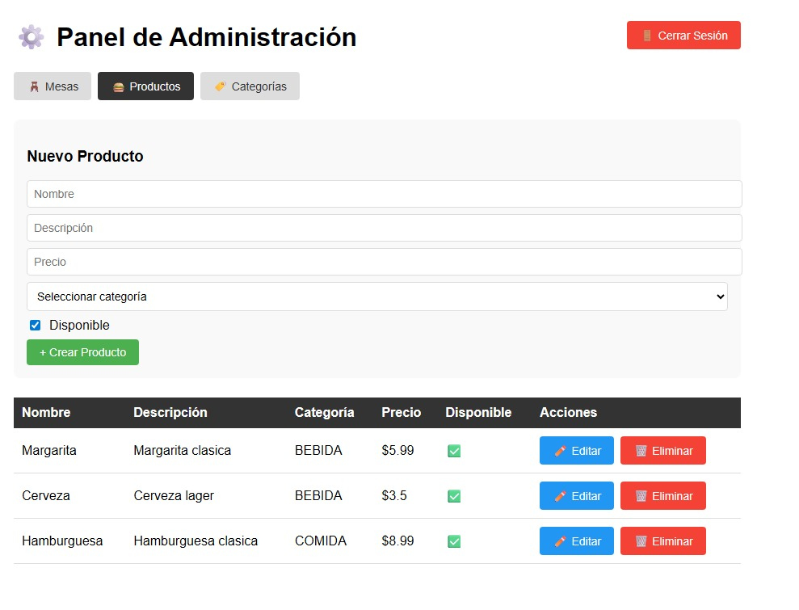

---

### Waiter View
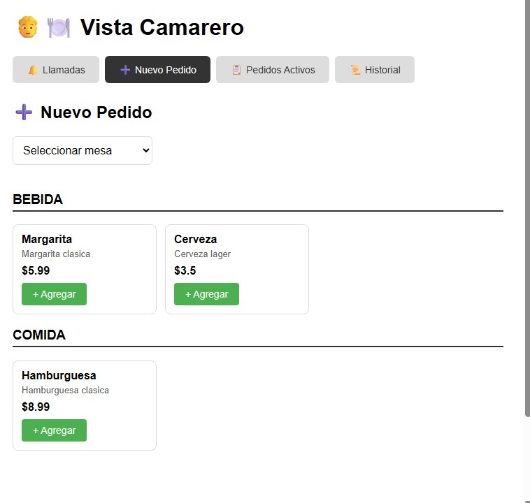
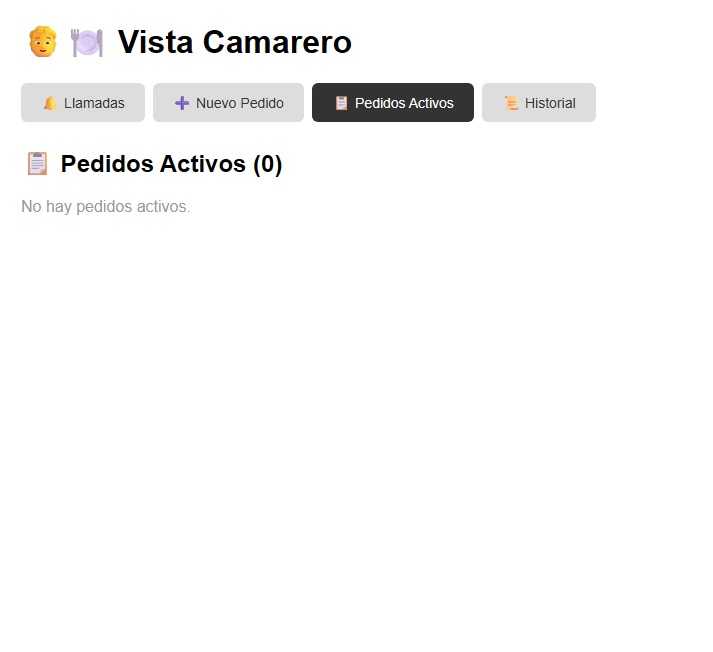
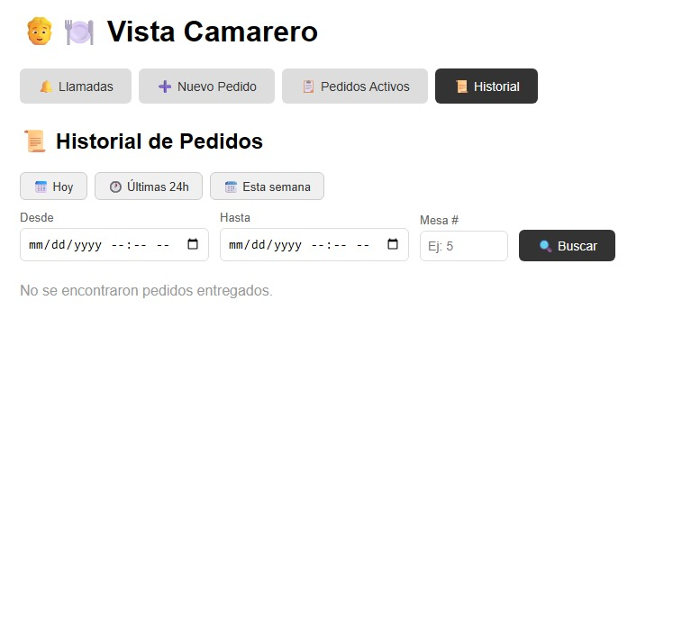
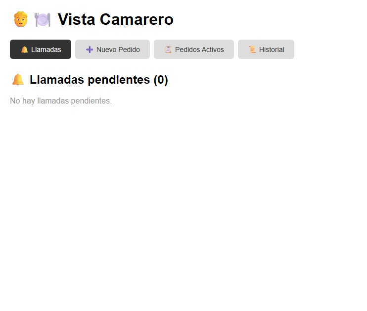

---

### Kitchen View
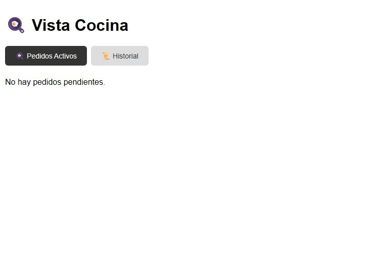
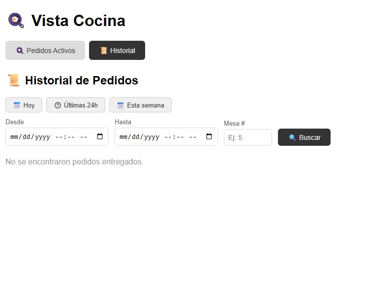


## 📡 Main Endpoints

### Tables
| Method | Route | Description |
|--------|-------|-------------|
| GET | `/mesas` | List all tables |
| POST | `/mesas` | Create a table |

### Products
| Method | Route | Description |
|--------|-------|-------------|
| GET | `/productos` | List all products |
| POST | `/productos` | Create a product |

### Orders
| Method | Route | Description |
|--------|-------|-------------|
| GET | `/pedidos` | List all orders |
| POST | `/pedidos` | Create an order |
| PATCH | `/pedidos/{id}/estado` | Update order status |
| GET | `/pedidos/pendientes` | List pending orders |

### WebSocket
| Channel | Description |
|---------|-------------|
| `/topic/pedidos` | Receives new orders and status updates |

WebSocket messages include a `tipo` field to distinguish between `NUEVO_PEDIDO` and `ACTUALIZACION_ESTADO`.

## ⚙️ Running Locally

### Requirements
- Java 17+
- MySQL 8+
- Node.js
- Maven (or use wrapper)

### Steps

1. Clone the repository
```bash
git clone https://github.com/MichaelCardenesG/restaurant-order-system.git
cd restaurant-order-system
```

2. Create the database in MySQL
```sql
CREATE DATABASE restaurant_system;
```

3. Configure your credentials in `src/main/resources/application.properties`
```properties
spring.application.name=restaurant-system
spring.datasource.url=jdbc:mysql://localhost:3306/restaurant_system
spring.datasource.username=your_username
spring.datasource.password=your_password

spring.jpa.hibernate.ddl-auto=update
spring.jpa.show-sql=true
```

4. Run the project
```bash
mvn spring-boot:run
```

5. Run frontend
```bash
npm install
npm start
```

The app will be available at:

Backend → http://localhost:8080
Frontend → http://localhost:3000

## 📦 Project Structure

```
src/main/java/com/restaurant/restaurant_system/
├── config/          # WebSocket configuration
├── controller/      # REST endpoints
├── dto/             # Data transfer objects
├── entity/          # Database models
├── exception/       # Global error handling
├── repository/      # Data access layer
└── service/         # Business logic
```

## 🧠 Challenges
```
- Designing a simple but functional UI for the waiter
- Avoiding duplicate orders in real-time communication
- Keeping kitchen and waiter views synchronized
- Managing live state updates without breaking the system
```

## 🚧 Future Improvements
```
- Role-based system (admin / waiter / kitchen)
- Authentication for all users
- Deployment (cloud or local network)
- UI/UX improvements
```


